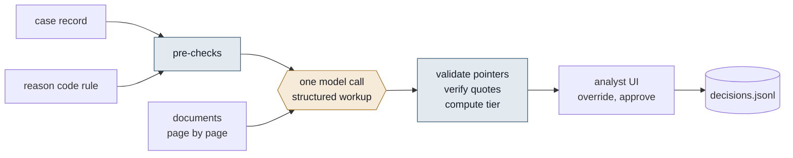

# Chargeback representment workup

A disputes analyst gets a chargeback, decides in about ninety seconds, and then spends eighteen minutes
re-reading the scheme rule, opening PDFs to check one date, and writing up why. This tool does the
eighteen minutes. For each case it lays out the rule, the evidence and the gap, drafts the rationale and
recommends an action: represent, accept liability, or request more evidence. The analyst decides.



Code decides what can be computed from the case record and the rule. The model only reads the documents.
Code then checks what the model read and says how far to trust it.

## Run it

Needs [uv](https://docs.astral.sh/uv/) (`curl -LsSf https://astral.sh/uv/install.sh | sh`). Python 3.12 is
fetched by uv if absent. No API key is needed for anything below: the ten workups are committed under
`artifacts/` and every command serves from them.

```bash
uv sync
uv run pytest                          # tests, no network
uv run python scripts/compare.py       # tool output vs my hand-written expectations
uv run python run.py CB-2025-0001      # one case as markdown, from cache
uv run streamlit run app.py            # the analyst UI
```

To regenerate the workups (or run a new case) you need a key:

```bash
cp .env.example .env                   # then set ANTHROPIC_API_KEY
uv run python run.py --all             # all ten, about $0.65 on claude-opus-5-5
uv run python run.py CB-2025-0004 --recompute   # one case, ignoring its cache
uv run python run.py CB-2025-0004 --dry-run     # print the exact prompt, make no call
```

`WORKUP_MODEL` in `.env` overrides the model. The model id is part of the cache key, so switching models
never replays another model's answers.

## What it produces

For every requirement of the reason code: a status (satisfied / partial / missing / not applicable), a
pointer to the document, the page and a verbatim quote, and the reasoning. Then a draft rationale, the
recommended action, what to ask the merchant for, and caveats. Every case gets a confidence tier with the
reasons that produced it.

On the ten provided cases: 46 pointers, 40 verified verbatim against the extracted text, 0 not found, 6
pointing at images (not text-verifiable by design). Queue: 5 high, 3 medium, 2 needs review. Cost of the
run: $0.65 at list price, every attempt metered (`scripts/compare.py` prints it from the stored token counts).

## Design decisions

**Code decides, the model reads.** The rule logic (all / any two / any one / non-representable) is data in
`workup/rules.py`. `workup/checks.py` takes AVS, CVV, 3DS, postcode match, date order and amount from the
transaction record. So Visa 10.5 ends in accept liability whatever the documents say. I still call the
model for it: the rule keeps one exception open (the issuer miscoded the transaction), and the model's only
job on such a case is to say whether the file shows any sign of that. On case 10 it put the answer in the
caveats. For requirements the record answers by itself (AVS/CVV and 3DS under Mastercard 4837 and 4863),
a "satisfied" that the record contradicts is downgraded to missing before the tier is computed.

**I extract the text myself.** `workup/docs.py` pulls every page with pdfplumber and each page goes into
the prompt as `<document name= page= of=>`. I know exactly what the model saw, page pointers come for
free, and every quote can be checked against the same text afterwards. The two PNGs go in as images. The
prompt says that text inside the document tags is evidence, not instructions, and a closing tag inside a
document is neutralised before sending. There is no OCR: every PDF here has a text layer. A scanned one
would need an OCR step in `extract_pages`.

**The output schema is the guardrail.** `Workup` in `workup/schema.py` is the required response format, so
statuses and actions are enums. What a JSON schema cannot express is checked in `validate_pointers`: the
document exists in this case, the page exists in the document, a satisfied requirement has a pointer. On a
failure the model gets its own answer back with the list of problems, once. On the final run every case
passed first time. On the run before, two did not (an extra requirement id; one requirement out of three
with an empty request list) and both passed on the second attempt. Problems that survive the retry are
kept and the case goes to needs review. An answer that does not parse at all is retried once from scratch
and then raised as an error, never cached. That happened once: the JSON degenerated into repeated
asterisks halfway through.

**Field order is the order the model writes in.** The rationale comes after the recommended action and the
list of evidence still needed, so the filed text is written after the model has said what is missing. In
the first version it came right after the requirement statuses, and on one case it asserted a
proof-of-delivery image that the same answer asked the merchant for. I moved the field and added a prompt
rule against exactly that in the same change, so I cannot say which one fixed it. The reordering is the
part that does not depend on the model following instructions.

**Confidence is computed, not asked for.** The model's own confidence is one weak input in
`workup/confidence.py`. The tier comes from things code can check: does the count of satisfied
requirements meet the rule's logic, were the quotes actually on the cited pages, does a transaction fact
cut against the recommendation, does a requirement rest only on an image, how much of the file is missing
when more evidence is requested, does the rationale mention something the same workup asks the merchant
for. Two things I got wrong first:

- Escalation only applied to represent. But accepting liability means the merchant eats the loss, so
  conceding a case where requirements are partly met is needs review too.
- Then I made every pre-check flag count everywhere, and case 4 (a clean accept) went to medium because of
  a failed AVS. A failed AVS makes a represent doubtful; on an accept it is the reason the call is right.
  A signal counts only against the recommendation it undermines.

Every tier comes with its reasons. Needs review never appears without a sentence saying why.

**Downgrade, do not discard.** A satisfied requirement whose quotes are not found in the document text
becomes partial with a note, because a failed match is usually the extractor, not the model. The analyst
sees "quote NOT found" next to the quote. The match is strict where it matters: word boundaries (ORD-551
does not match inside ORD-5512), punctuation becomes a space rather than nothing (12.50 does not match
inside 1,250.00), and a two-word fragment without a digit does not count as evidence.

## For the analyst

`app.py` sorts the queue by tier, hardest first, then by amount. A case opens as rule / evidence / gap with
the requirement checklist under it. Each pointer expands to the quote, its verification status, and the
cited page rendered with the quote highlighted (`workup/render.py`, from pdfplumber's word boxes).
Checking a pointer never means opening a file. Image documents are shown as they are. Under the checklist
every document of the case can be paged through, with cited pages marked; that is where the analyst looks
for what the model did not use. Every status can be overridden, the rationale edited, the action changed.
Approve writes a record to `artifacts/decisions.jsonl` with what the tool proposed next to what the
analyst chose. That log is the data you would need later to see where the tool is wrong.

The UI never calls the API. A stale cache is reported, not refreshed.

## Checking myself

`expected.json` is my answer for each case, written after reading every document and before running the
tool on all ten. `scripts/compare.py` prints agreement on the action and whether the tool was at least as
cautious as I was, plus the tier distribution, because "mark everything needs review" would score
perfectly on caution and save nobody any time.

First run: eight of ten. One disagreement was a judgement call (does a freight company's own manifest
count as carrier confirmation when it is also the carrier); I added the tool's answer as acceptable. On
the other the tool was right: the hotel charge is dated 26 April while the booking says the rate was
charged on 12 March, which I had missed. I also lowered the attention level I expected on one case after
seeing a clean, actionable request list. All three edits keep the original value and the reason in the
file, and compare.py prints `(key revised: ...)` on those rows.

Final run: ten of ten on action, ten of ten on caution. On the run before it one case was a miss: the tool
said high where I wanted medium, and I left it as a miss rather than tune a rule to one case. It came out
medium on the final run because the model's own confidence came back medium, which is the signal I trust
least. That is why calibration comes before any claim about the tiers.

Before submitting I tested the code layer with adversarial inputs rather than the ten cases (can 12.50
match inside 1,250.00, what happens with a half-written artifact) and fixed what that found. None of it
moved a tier on the ten cases. Each fix has a test in `tests/test_review_fixes.py`.

## Limitations

- No OCR. Every PDF here has a text layer.
- The rules are the take-home's simplified ones, not Visa VCR or the Mastercard Chargeback Guide: no time
  limits, thresholds or exclusions.
- The rationale-consistency check matches identifier-shaped tokens and over-fires when a reference is used
  as context in a request. It only raises the tier to medium and says what to look at.
- Ten cases is not an evaluation. It is enough to catch design errors, and it did, and not enough to quote
  an accuracy number. The confidence rules were tuned after seeing where the tool and I disagreed, which is
  how a small set should be used and why a number from it means little.
- The UI keeps edits only until the analyst switches case; approve records them.
- No auth, no deployment, single-user decision log.

## If this were going into production

**Measure first.** The eighteen minutes is the claim and nothing about it is measurable yet. The decision
log needs the analyst, timestamps and the rule version next to the prompt fingerprint it already has, and
a handle-time baseline before the tool is switched on. Then two weeks in shadow mode, then cases
randomised between assisted and unassisted. The numbers for a Director: handle time at an unchanged win
rate, and the false-accept rate (cases the tool would have conceded that analysts represented and won).

**An evaluation.** Two to three hundred closed cases, labelled per requirement by two analysts who have not
seen the tool's output; their agreement is the ceiling. Page recall separate from action agreement, because
finding the evidence and making the right call fail differently. A frozen golden set that is never tuned
on, plus adversarial cases for each prompt rule. Rules 3 to 6 of the prompt each answer one trap in the
provided cases; an ablation on held-out cases would show whether they generalise, and I have not run one.

**Where the case comes from.** The scheme message, the dispute system, and transaction data the acquirer
already holds. For Visa 10.4 the compelling evidence is two prior undisputed transactions matching on
device or IP: a lookup in the acquirer's own history, not a merchant upload, and the biggest single win
here. The approved rationale goes back to the dispute system. The tool never files with the scheme.

**The rest, shorter.** OCR for pages with no text layer, PAN redaction before anything reaches the prompt,
page pre-selection for long manifests by the case's own identifiers, scheme deadlines in the queue sort.
For a non-representable code, one cheap question ("any sign the code was misapplied?") instead of a full
workup. A schema built per case, with fixed requirement fields and an enum of file#page, would have
prevented the corrective round-trips seen in earlier runs. One call per case stays: the duplicate-charge
catch on the hotel case needed the whole file in view. Cost is not the argument (about five dollars per
analyst per day); latency is, so the workup is computed when the case arrives, through the batch API. For
the tier, keep the hard gates and replace the rest with a score fitted on analyst overrides, with override
rate per tier published. Never automated: filing with the scheme, accepting liability above a set amount,
any action that contradicts a pre-check, any statement that a cardholder committed fraud.

Two more weeks, in order: instrument the log and measure the baseline; the golden set, labelled blind; the
10.4 prior-transaction lookup; per-attempt cost and latency logging; the adversarial pack and the ablation.
