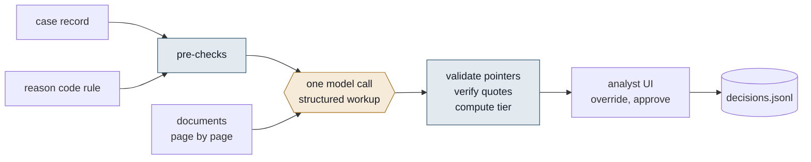

# Chargeback representment workup

A disputes analyst gets a chargeback, decides in about ninety seconds, and then spends eighteen minutes
re-reading the scheme rule, opening PDFs to check one date, and writing up why. This tool does the
eighteen minutes. For each case it lays out the rule, the evidence and the gap, drafts the rationale and
recommends an action: represent, accept liability, or request more evidence. The analyst decides.



Code decides what can be computed from the case record and the rule. The model only reads the documents.
Code then checks what the model read and says how far to trust it. Longer notes on the decisions, what
went wrong first and the production plan are in [docs/design-notes.md](docs/design-notes.md).

## Run it

Needs [uv](https://docs.astral.sh/uv/) (`curl -LsSf https://astral.sh/uv/install.sh | sh`). Python 3.12 is
fetched by uv if absent. No API key is needed for anything below: the ten workups are committed under
`artifacts/` and every command serves from them.

```bash
uv sync
uv run pytest                          # tests, no network
uv run python scripts/compare.py       # tool output vs my hand-written expectations
uv run python run.py CB-2025-0001      # one case as markdown, from cache
uv run streamlit run app.py            # the analyst UI
```

To regenerate the workups (or run a new case) you need a key:

```bash
cp .env.example .env                   # then set ANTHROPIC_API_KEY
uv run python run.py --all             # all ten, about $0.65 on claude-opus-5-5
uv run python run.py CB-2025-0004 --recompute   # one case, ignoring its cache
uv run python run.py CB-2025-0004 --dry-run     # print the exact prompt, make no call
```

`WORKUP_MODEL` in `.env` overrides the model. The model id is part of the cache key, so switching models
never replays another model's answers.

## What it produces

For every requirement of the reason code: a status (satisfied / partial / missing / not applicable), a
pointer to the document, the page and a verbatim quote, and the reasoning. Then a draft rationale, the
recommended action, what to ask the merchant for, and caveats. Every case gets a confidence tier with the
reasons that produced it.

On the ten provided cases: 46 pointers, 40 verified verbatim against the extracted text, 0 not found, 6
pointing at images (not text-verifiable by design). Queue: 5 high, 3 medium, 2 needs review. Cost of the
run: $0.65, every attempt metered.

## How it works

- **Code decides, the model reads.** Rule logic (all / any two / any one / non-representable) is data in
  `workup/rules.py`; AVS, CVV, 3DS, postcode match, dates and amount come from the transaction record in
  `workup/checks.py`. Visa 10.5 ends in accept liability whatever the documents say, and a "satisfied" on
  an AVS or 3DS requirement that the record contradicts is downgraded before the tier is computed.
- **I extract the text myself.** Each PDF page goes into the prompt as `<document name= page= of=>`, so I
  know what the model saw and every quote can be checked against the same text afterwards. The two PNGs go
  in as images. Document text is marked as evidence, not instructions.
- **The output schema is the guardrail.** `Workup` in `workup/schema.py` is the required response format.
  What a schema cannot express (the document exists, the page exists, a satisfied requirement has a
  pointer) is checked in code, with one corrective round-trip to the model on failure.
- **Confidence is computed, not asked for.** The tier in `workup/confidence.py` comes from things code can
  check: coverage against the rule's logic, quote verification, pre-checks that cut against the
  recommendation, image-only support, the size of the gap. Every tier comes with its reasons.
- **Downgrade, do not discard.** A satisfied requirement whose quote is not found on the cited page
  becomes partial with a note, because a failed match is usually the extractor, not the model.

## For the analyst

`app.py` sorts the queue by tier, hardest first, then by amount. A case opens as rule / evidence / gap with
the requirement checklist under it. Each pointer expands to the quote, its verification status, and the
cited page rendered with the quote highlighted, so checking a pointer never means opening a file. Every
document of the case can be paged through below, with cited pages marked. Every status can be
overridden, the rationale edited, the action changed. Approve writes a record to
`artifacts/decisions.jsonl` with what the tool proposed next to what the analyst chose. The UI never
calls the API.

## Checking myself

`expected.json` is my answer for each case, written after reading every document and before running the
tool on all ten. `scripts/compare.py` prints agreement on the action, whether the tool was at least as
cautious as I was, and the tier distribution. First run: eight of ten. Three keys were revised after
reading the tool's reasoning (once because the tool was right and I had missed a date); each keeps the
original value and the reason in the file, and compare.py prints them as revised. Final run: ten of ten
on both. Ten cases is not an evaluation; it is enough to catch design errors, and it did.

## Limitations

- No OCR. Every PDF here has a text layer; a scanned one would need an OCR step in `extract_pages`.
- The rules are the take-home's simplified ones, not Visa VCR or the Mastercard Chargeback Guide.
- The rationale-consistency check over-fires when a reference is used as context in a request; it only
  raises the tier to medium and says what to look at.
- The prompt rules answer the traps in the provided cases; I have not tested them on cases the tool has
  not seen.
- The UI keeps edits only until the analyst switches case; approve records them.
- No auth, no deployment, single-user decision log.

## What I would do next

1. Instrument the decision log (analyst, timestamps, rule version) and measure a handle-time baseline,
   because the eighteen minutes is a claim until then. Then shadow mode, then assisted vs unassisted.
2. A real evaluation: a few hundred closed cases labelled blind per requirement, page recall kept apart
   from action agreement, a frozen golden set plus adversarial cases, an ablation of the prompt rules.
3. Pull the Visa 10.4 prior-transaction evidence from the acquirer's own history instead of merchant
   uploads. It is a lookup, and the biggest single win.
4. Per-attempt cost and latency logging, a cache breakpoint after the documents, precompute on arrival
   through the batch API.
5. Ingestion for real documents: OCR fallback, PAN redaction, page pre-selection for long manifests.

The reasoning behind each, and what should never be automated, is in
[docs/design-notes.md](docs/design-notes.md).
