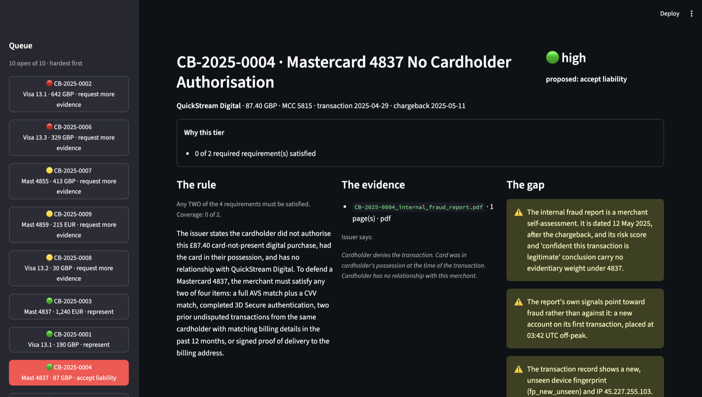
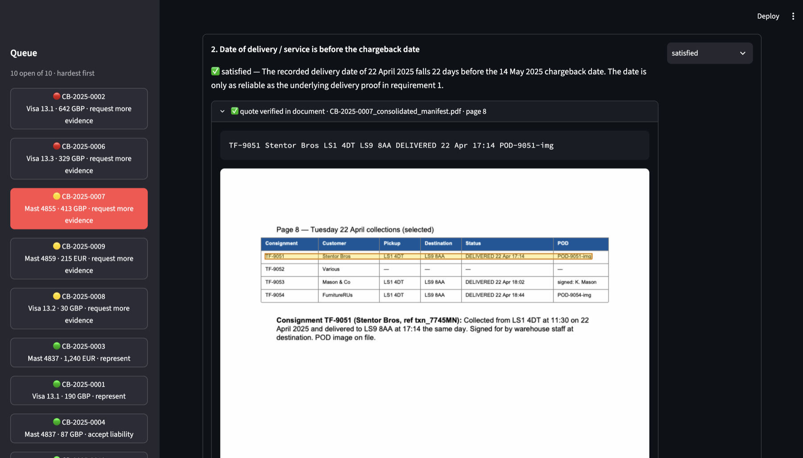

# Walkthrough

A five-minute tour of the tool on three of the ten cases. Everything here runs from the repo with no API
key: `uv sync && uv run streamlit run app.py`.

## The problem, and what the tool does

When a customer disputes a payment, a disputes analyst has to decide whether the merchant can fight it.
The decision itself takes a minute or two. What takes the time is everything around it: re-reading the
scheme rule, opening the merchant's PDFs to check a date or a postcode, and writing up the justification.

The tool does that second part. It takes a case, finds the rule for its reason code, reads the documents,
and puts three things on one screen: what the rule requires, which document proves each point and where
exactly, and what is missing. It recommends one of three actions (represent, accept liability, or ask the
merchant for a specific piece of evidence) and drafts the justification text. The analyst decides.

One design idea behind it: the model only reads. Everything that can be computed is done in code before
the model sees anything (which rule applies, how many requirements it needs, whether the address matched,
whether 3DS passed). The model answers in a fixed structure: for every requirement, a status, the file,
the page and a verbatim quote. Then code checks the answer: every quote is looked up in the actual
document, and the confidence tier comes from those checks rather than from the model's own opinion.

The queue on the left is sorted hardest first. Each case opens as rule / evidence / gap, with the
requirement checklist under it and the reasons for its confidence tier at the top.

## Case 4: confident tone, no evidence

Mastercard 4837, "no cardholder authorisation". The merchant sent one document, its own internal fraud
report: a risk score and the line "we are confident this transaction is legitimate". It sounds like
evidence.

The rule needs any two of four specific things: an AVS and CVV match, 3DS authentication, prior
transactions from the same customer, or signed delivery. The transaction record says AVS failed, CVV
failed, 3DS was not attempted, and this was the customer's first order. The report meets none of the four,
and it is dated the day after the chargeback.

The tool says accept liability, with high confidence, and the reasoning says why in one line: a merchant's
own risk score is not compelling evidence. For the analyst this is a thirty-second case.

## Case 7: the evidence is on page eight

Mastercard 4855, "services not provided". A freight company; the customer says the shipment was never
collected. The merchant sent a ten-page manifest, and pages one to seven are somebody else's deliveries.
The record that matters is on page eight: consignment TF-9051, referenced to this transaction, collected
on 22 April and delivered the same day.

The tool found it, quoted it word for word, and renders the page with the quote highlighted, so the
analyst does not have to open the PDF.

It then did not recommend representing. It asked for more evidence, for three reasons: the manifest is
the merchant's own record, because this merchant is also the carrier; the proof-of-delivery image it
mentions is not in the file; and the signature is from warehouse staff, not the customer. It asks the
merchant for the POD image and the collection scan.

I had written "represent" in my own answer key before running the tool. I read its reasons and accepted
them as a fair reading of the rule, and kept my original answer in `expected.json` so the change is
visible. The tool is more cautious than I was. Whether that caution is right is what you would measure
from analyst overrides once it runs on real cases.

## Case 2: the tool refuses to decide

Visa 13.1, "merchandise not received", 642 pounds. According to the tracking it was delivered, but to
postcode M1 7DR, and the card's billing postcode is M14 5RT. AVS failed. 3DS was only attempted. The
customer says that address is not theirs.

The tool puts the case at the top of the queue as "needs review" and lists every reason. The only proof
of delivery is a screenshot, so it is shown inline: code cannot verify text on an image, a person has to
look. It asks for prior orders to that address. I would have accepted liability. Either way this is a case
a human should look at, and the tool's job was to make that obvious in five seconds rather than after
twenty minutes of reading.

## What the analyst can change

Everything on the screen can be overridden: the status of each requirement, the action, the text.
Approving writes a record to `artifacts/decisions.jsonl` that keeps what the tool proposed next to what
the analyst chose. That log is the data you would need to see where the tool is wrong, per reason code.

## Limits, and what I would do next

Ten cases is not an evaluation. My answer key was written before the first run, three of ten answers were
revised after, and every revision is in the file. The prompt rules answer the traps in these ten cases and
I have not tested them on cases the tool has not seen. There is no OCR, because every PDF here has a text
layer. The rules are the simplified ones from the brief, not the real scheme rulebooks.

Next, in order: instrument the decision log and measure a baseline for handle time, because the eighteen
minutes is a claim until then; a proper evaluation set of a few hundred closed cases; and the Visa 10.4
prior-transaction evidence pulled from the acquirer's own data instead of asked from merchants. The
reasoning is in [design-notes.md](design-notes.md).
